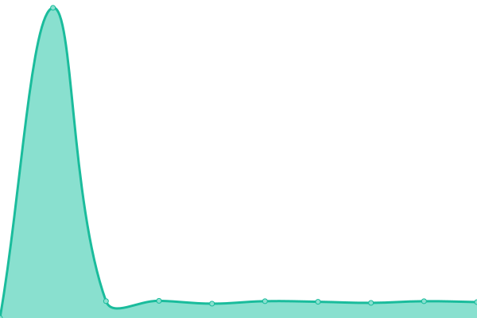
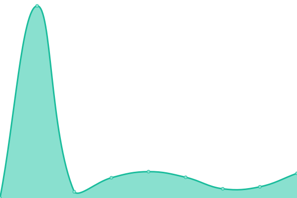

# [📈 Live Status](https://status.dpi0.cloud): <!--live status--> **🟧 Partial outage**

This repository contains the open-source uptime monitor and status page for [divyansh](dpi0.cloud), powered by [Upptime](https://github.com/upptime/upptime).

With [Upptime](https://upptime.js.org), you can get your own unlimited and free uptime monitor and status page, powered entirely by a GitHub repository. We use [Issues](https://github.com/dpi0/status/issues) as incident reports, [Actions](https://github.com/dpi0/status/actions) as uptime monitors, and [Pages](https://status.dpi0.cloud) for the status page.

<!--start: status pages-->
<!-- This summary is generated by Upptime (https://github.com/upptime/upptime) -->
<!-- Do not edit this manually, your changes will be overwritten -->
<!-- prettier-ignore -->
| URL | Status | History | Response Time | Uptime |
| --- | ------ | ------- | ------------- | ------ |
|  [Blog](https://dpi0.cloud) | 🟩 Up | [blog.yml](https://github.com/dpi0/status/commits/HEAD/history/blog.yml) | 

 178ms
     
 | 

<a href="https://status.dpi0.cloud/history/blog">100.00%</a>
    

|  [URL Shorterner](https://k.dpi0.cloud) | 🟩 Up | [url-shorterner.yml](https://github.com/dpi0/status/commits/HEAD/history/url-shorterner.yml) | 

 1089ms
     
 | 

<a href="https://status.dpi0.cloud/history/url-shorterner">100.00%</a>
    

|  [Imgur](https://img.dpi0.cloud) | 🟩 Up | [imgur.yml](https://github.com/dpi0/status/commits/HEAD/history/imgur.yml) | 

 829ms
     
 | 

<a href="https://status.dpi0.cloud/history/imgur">100.00%</a>
    

|  [Redlib](https://red.dpi0.cloud) | 🟩 Up | [redlib.yml](https://github.com/dpi0/status/commits/HEAD/history/redlib.yml) | 

 2019ms
     
 | 

<a href="https://status.dpi0.cloud/history/redlib">100.00%</a>
    

|  [Forge](https://git.dpi0.cloud) | 🟩 Up | [forge.yml](https://github.com/dpi0/status/commits/HEAD/history/forge.yml) | 

 1012ms
     
 | 

<a href="https://status.dpi0.cloud/history/forge">100.00%</a>
    

|  [Google](https://www.google.com) | 🟩 Up | [google.yml](https://github.com/dpi0/status/commits/HEAD/history/google.yml) | 

 141ms
     
 | 

<a href="https://status.dpi0.cloud/history/google">100.00%</a>
    

|  [Wikipedia](https://en.wikipedia.org) | 🟩 Up | [wikipedia.yml](https://github.com/dpi0/status/commits/HEAD/history/wikipedia.yml) | 

 523ms
     
 | 

<a href="https://status.dpi0.cloud/history/wikipedia">100.00%</a>
    

|  [Hacker News](https://news.ycombinator.com) | 🟩 Up | [hacker-news.yml](https://github.com/dpi0/status/commits/HEAD/history/hacker-news.yml) | 

 330ms
     
 | 

<a href="https://status.dpi0.cloud/history/hacker-news">100.00%</a>
    

|  [Test Broken Site](https://thissitedoesnotexist.koj.co) | 🟥 Down | [test-broken-site.yml](https://github.com/dpi0/status/commits/HEAD/history/test-broken-site.yml) | 

 0ms
     
 | 

<a href="https://status.dpi0.cloud/history/test-broken-site">100.00%</a>
    

|  [IPv6 test](forwardemail.net) | 🟥 Down | [i-pv6-test.yml](https://github.com/dpi0/status/commits/HEAD/history/i-pv6-test.yml) | 

 0ms
     
 | 

<a href="https://status.dpi0.cloud/history/i-pv6-test">100.00%</a>
    

<!--end: status pages-->

[**Visit our status website →**](https://status.dpi0.cloud)

## 📄 License

- Powered by: [Upptime](https://github.com/upptime/upptime)
- Code: [MIT](./LICENSE) © [Anand Chowdhary](https://anandchowdhary.com), supported by [Pabio](https://pabio.com)
- Data in the `./history` directory: [Open Database License](https://opendatacommons.org/licenses/odbl/1-0/)
